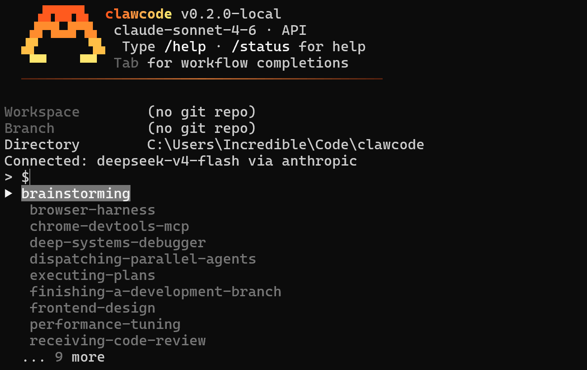

# Claw Code

A terminal-native AI coding assistant built in Rust. Connects to Anthropic's Messages API and OpenAI-compatible providers (LM Studio, Ollama, vLLM, OpenRouter). Features a full REPL, MCP integration, WASM-based plugin system, agent delegation, and a permission-gated tool ecosystem.



## Features

- **Dual Provider** — Anthropic Claude + any OpenAI-compatible endpoint (local or cloud)
- **REPL & One-Shot** — Interactive session or single `claw "prompt"` invocation
- **MCP** — Full Model Context Protocol over stdio, SSE, remote, and OAuth
- **Plugins** — WASM-based extensions with versioned marketplace
- **Agents** — `@agent` delegation for sub-task parallelism
- **Skills** — Composable workflows via `/skill` slash commands
- **Tools** — Bash, file R/W/E, grep, glob, PDF/Excel/Word extraction, web
- **Permissions** — ReadOnly / WorkspaceWrite / DangerFullAccess tiers
- **Session Persistence** — Save / resume / export to JSONL

## Quick Start

### Prerequisites

- Rust 2021 edition
- MSVC + Clang-CL 22.x (see `CompilePreSet.bat`)
- NASM, Perl (optional, for OpenSSL)

### Tool Dependencies

- **Git Bash** must be installed at `C:\Program Files\Git`. Download from [git-scm.com](https://git-scm.com) (use "Portable" or "Full installer" — either works).
- **ripgrep** (`rg.exe`) — place in `C:\Program Files\Git\bin`. Repository: [github.com/BurntSushi/ripgrep](https://github.com/BurntSushi/ripgrep). Download from [releases](https://github.com/BurntSushi/ripgrep/releases) (Windows zip, extract `rg.exe`).
- **fd** (`fd.exe`) — place in `C:\Program Files\Git\bin`. Repository: [github.com/sharkdp/fd](https://github.com/sharkdp/fd). Download from [releases](https://github.com/sharkdp/fd/releases) (Windows zip, extract `fd.exe`).

### Build

```bat
CompilePreSet.bat && cargo build --release
```

### Run

```bat
start.bat
```

Or with a local LLM via LM Studio:

```bat
run_local_openai.bat
```

### Configure

Reference config lives in `.claw/` — place it in the project root for per-project settings, or at `~/.claw/` for a global user-level config. Copy `.env.example` to `.claw/.env` and set your API key or local endpoint.

### Claude Code Plugin Compatibility

Claw Code auto-loads plugins from `~/.claude/plugins/` — any Claude Code plugin installed there is available without additional setup.

## Project Structure

```
Claw Code/
├── .claw/                        # Config (project-local; or use ~/.claw/ for global)
│   ├── agents/                   # Sub-agent definitions
│   ├── skills/                   # Skill workflow definitions
│   ├── settings.json
│   └── .env
├── rust/                         # Rust workspace (binary: claw)
│   ├── Cargo.toml
│   ├── crates/
│   │   ├── agents/               # Agent delegation engine
│   │   ├── api/                  # Provider-agnostic API client
│   │   ├── commands/             # Slash commands, skills, MCP dispatch
│   │   ├── compat-harness/       # Claude Code project manifest compat
│   │   ├── mock-anthropic-service/ # Test mock
│   │   ├── plugin-types/         # Plugin shared types
│   │   ├── plugins/              # WASM plugin loader & marketplace
│   │   ├── runtime/              # Core engine: config, MCP, permissions
│   │   ├── rusty-claude-cli/     # Main CLI binary entrypoint
│   │   ├── telemetry/            # Analytics infrastructure
│   │   └── tools/                # Tool implementations
│   └── target/
├── CompilePreSet.bat             # MSVC + Clang-CL environment
├── start.bat                     # Launch with VS2022 env
├── startenv.bat                  # Launch with full env setup
├── run_local_openai.bat          # Launch against LM Studio
├── build_rust_clang_msvc.bat     # Build script
├── dump_server.py                # Request dump server (debugging)
├── .env.example                  # Environment template
└── LICENSE                       # MIT
```

## License

MIT
