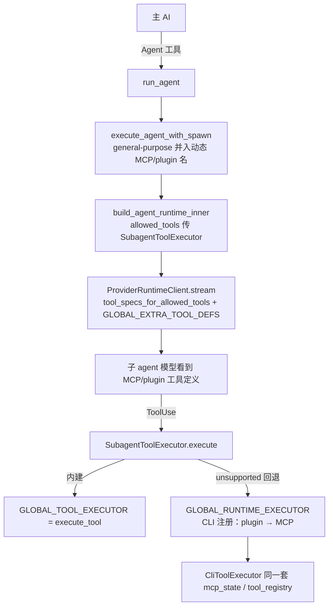

# 子 agent 委托 MCP / Plugin / Skill 调用 — 设计文档

- **日期:** 2026-08-10
- **状态:** Approved
- **范围:** clawcode `rust` workspace（`agents` / `tools` / `claw-cli` 三个 crate）

## 1. 背景与问题

主 AI 已有 MCP 工具（`MCPTool`、`ToolSearch`、`mcp__<server>__<tool>`、`ListMcpResourcesTool`、`ReadMcpResourceTool`）和 plugin 工具的直接调用能力，但对子 agent 的委托能力存在两层缺口：

1. **能力缺口**：子 agent 的执行器 `SubagentToolExecutor::execute` 只路由到全局 `GLOBAL_TOOL_EXECUTOR`（= `execute_tool`，纯内建分支）。MCP / plugin 工具被子 agent 调用时落入 `_ => Err("unsupported tool")`（`tools/src/lib.rs:668`）。
2. **可见性缺口**：子 agent 的工具定义由 `tool_specs_for_allowed_tools`（`agents/src/runtime.rs:753-760`）从 `mvp_tool_specs()` 过滤生成，MCP / plugin 工具定义**不会**广播给子 agent 模型，子 agent 无从知晓这些工具的存在。
3. **提示词缺口**：`Agent` 工具描述（`runtime/src/tool_registry/specs.rs:307-308`）、`MCPTool` 描述（`claw-cli/src/main.rs:4450-4515`）、子 agent 系统提示词（`agents/src/runtime.rs:773-789`）均未引导模型把 MCP / plugin / skill 相关工作委托给子 agent。

**目标**：让主 AI 能（自行判断）把 MCP / plugin / skill 相关任务委托给子 agent，且子 agent 真正具备执行这些工具的能力。

## 2. 设计决策

| 决策点 | 结论 |
|---|---|
| 改动范围 | 提示词层 + 能力层（两者都需要，否则提示词引导后跑不通） |
| 委托策略 | 由模型自主判断（提示词只说明能力边界，不强制作业顺序） |
| 能力层触发条件 | 仅 `general-purpose` 子 agent 默认并入动态 MCP/plugin 工具名；Explore/Plan/Verification 保持只读工具集（仅 Skill 例外） |
| 兼容性 | 模型显式指定 `allowed_tools` 时以显式值为准，不做并集 |

## 3. 能力层设计

### 3.1 新增全局注册点（`agents` crate）

在 `agents/src/runtime.rs` 新增两个全局：

```rust
// 既有：GLOBAL_TOOL_EXECUTOR（内建工具，tools_init 注册）
static GLOBAL_RUNTIME_EXECUTOR: OnceLock<
    Box<dyn Fn(&str, &Value, Option<&PermissionPolicy>) -> Result<String, String> + Send + Sync>,
> = OnceLock::new();

static GLOBAL_EXTRA_TOOL_DEFS: OnceLock<Arc<Vec<ToolDefinition>>> = OnceLock::new();
```

新增注册 API：

```rust
pub fn register_runtime_tool_provider(
    executor: Box<dyn Fn(&str, &Value, Option<&PermissionPolicy>) -> Result<String, String> + Send + Sync>,
    tool_defs: Vec<ToolDefinition>,
) -> Result<(), String>; // OnceLock::set 语义，重复注册报错
```

### 3.2 CLI 注册（`claw-cli/src/main.rs`）

`build_runtime_mcp_state`（main.rs:4372-4390）已产出 `runtime_tools`（MCP 发现工具 + wrapper 工具定义）。注册发生在 `build_runtime_with_plugin_state`（main.rs:7886）**真实运行时构建路径**——不在 `build_runtime_plugin_state_with_loader`，因为后者也会被 `--allowedTools` 参数校验调用且立即关闭 MCP 状态，注册会绑定到已关闭的 state。流程：

1. 收集额外工具定义：
   - MCP 发现工具：`mcp_runtime_tool_definition`（main.rs:4432）
   - MCP wrapper：`mcp_wrapper_tool_definitions`（main.rs:4450）
   - plugin 工具：`tool_registry` 中的 `plugin_tools` 定义
   - 排除内建 `mvp_tool_specs`（子 agent 内建集由 `tool_specs_for_allowed_tools` 单独组装）
2. 构造 executor 闭包，捕获 `Arc<Mutex<RuntimeMcpState>>` 与 `GlobalToolRegistry`：
   - `tool_registry.has_runtime_tool(name)` → `dispatch_mcp_tool`（与 `CliToolExecutor::execute_runtime_tool` 共用，main.rs:9912）
   - 否则 → `tool_registry.execute`（plugin / 残余内建）
   - 都找不到 → `Err("unsupported tool")`
3. 调用 `tools::register_runtime_tool_provider(executor, tool_defs)`（幂等，重复注册为 no-op）。

> 注册发生在 `tools_init()`（main.rs:373）之后，两者互不冲突；`GLOBAL_RUNTIME_EXECUTOR` 只补充子 agent 的执行路由，不影响主 AI 的 `CliToolExecutor`。

### 3.3 子 agent 执行器回退（`agents/src/runtime.rs:670-751`）

`SubagentToolExecutor::execute` 在 `GLOBAL_TOOL_EXECUTOR` 返回 `unsupported tool` 时回退到 `GLOBAL_RUNTIME_EXECUTOR`：

```rust
let result = exec(tool_name, &value, self.policy.as_ref());
match result {
    Ok(v) => Ok(v),
    Err(e) if is_unsupported_tool(&e) => {
        if let Some(runtime_exec) = GLOBAL_RUNTIME_EXECUTOR.get() {
            runtime_exec(tool_name, &value, self.policy.as_ref()).map_err(ToolError::new)
        } else {
            Err(ToolError::new(e))
        }
    }
    Err(e) => Err(ToolError::new(e)),
}
```

其中 `is_unsupported_tool` 匹配 `unsupported tool: <name>` 错误前缀。

### 3.4 工具定义合并（`agents/src/runtime.rs:753-760`）

`tool_specs_for_allowed_tools` 在过滤 `mvp_tool_specs()` 之后，追加 `GLOBAL_EXTRA_TOOL_DEFS` 中满足 `allowed_tools` 过滤的项，保证子 agent 模型能看到 MCP / plugin 工具定义。

### 3.5 general-purpose 工具并集（`tools/src/lib.rs:5278-5281`）

`execute_agent_with_spawn` 中，当 `subagent_type` 归一化为 `general-purpose` 且 `input.allowed_tools` 为 `None` 时：

```rust
let mut allowed = allowed_tools_for_subagent(lookup_subagent);
if lookup_subagent == "general-purpose" {
    if let Some(defs) = agents::runtime::registered_extra_tool_defs() {
        allowed.extend(defs.iter().map(|d| d.name.clone()));
    }
}
```

> 需要 `agents` 暴露 `registered_extra_tool_defs() -> Option<Arc<Vec<ToolDefinition>>>`。

## 4. 提示词层设计

| 位置 | 改动内容 |
|---|---|
| `runtime/src/tool_registry/specs.rs:307` `Agent` 描述 | 追加：`For MCP, plugin, or skill work that is multi-step or benefits from isolated context, delegate to a 'general-purpose' sub-agent.` |
| `claw-cli/src/main.rs:4450` `MCPTool` 描述 | 说明可直接调用；复杂流程可委托子 agent |
| `agents/src/runtime.rs:773` `build_agent_system_prompt` | 追加一行：`You have access to MCP tools, plugin tools, and skills when they are available to you. Use them to complete the delegated task.` |
| `agents/src/normalize.rs:61-65` `general-purpose` | `Skill` 已在列表；MCP/plugin 动态名靠 3.5 能力层并入，无需改静态表 |

## 5. 数据流



## 6. 错误处理

- `GLOBAL_RUNTIME_EXECUTOR` 未注册（无 MCP/plugin 配置时）：回退逻辑自然失效，子 agent 行为与现状一致。
- 重复注册：`register_runtime_tool_provider` 返回错误；CLI 调用处忽略（与 `register_tool_executor` 的 no-op 语义一致）。
- 子 agent 调用未允许的 MCP 工具：`allowed_tools` 过滤在 `SubagentToolExecutor::execute` 入口已拦截（runtime.rs:672-676），返回明确的 tool-not-enabled 错误。

## 7. 测试计划

| 层级 | 测试 |
|---|---|
| agents 单元测试 | `register_runtime_tool_provider` 注册/重复注册报错；`tool_specs_for_allowed_tools` 合并 extra defs 且按 allowed_tools 过滤 |
| agents 单元测试 | `SubagentToolExecutor::execute` 对 `unsupported tool` 回退到 runtime executor；未注册时保持原错误 |
| agents 单元测试 | `general-purpose` allowed_tools 并集包含 extra tool 名（用 mock defs） |
| claw-cli 集成测试 | `build_runtime_mcp_state` 后注册链路：executor 能路由 plugin/MCP 工具 |
| 既有回归 | `tools` / `claw-cli` 全量测试保持绿 |

## 8. 非目标

- 不改主 AI 的 `CliToolExecutor` 直接调用路径（MCP/plugin 主循环直接调用不受影响）。
- 不引入强制"所有 MCP/plugin 调用都必须委托"的策略。
- 不为 Explore/Plan/Verification 动态并入 MCP/plugin 工具（保持只读/受限）。
